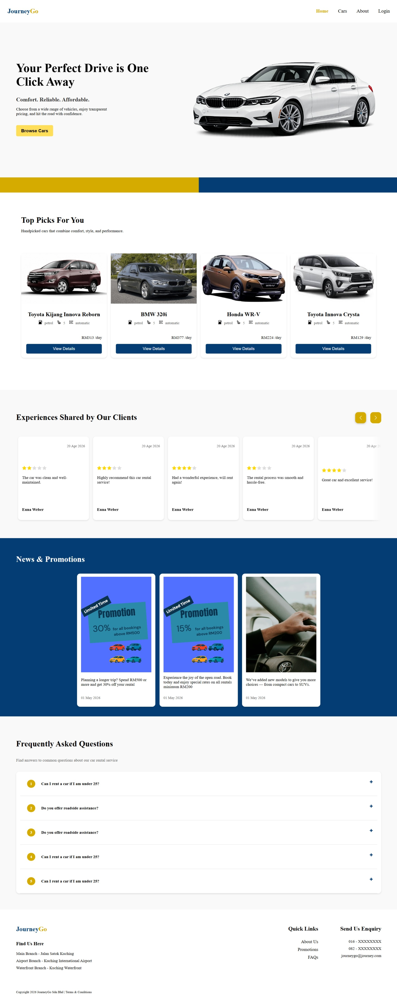
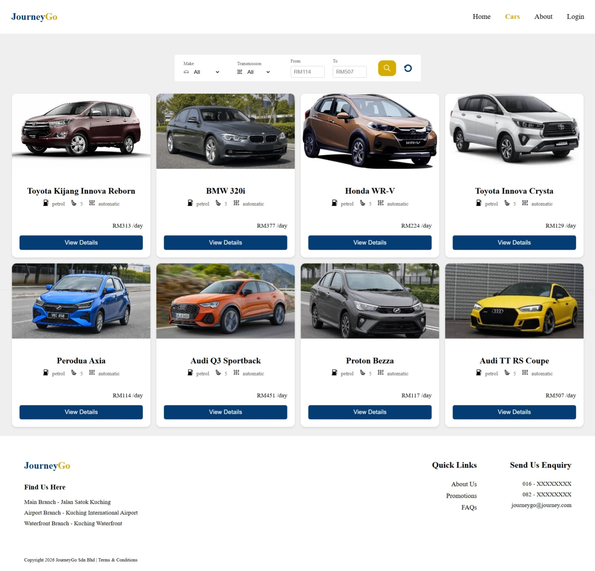
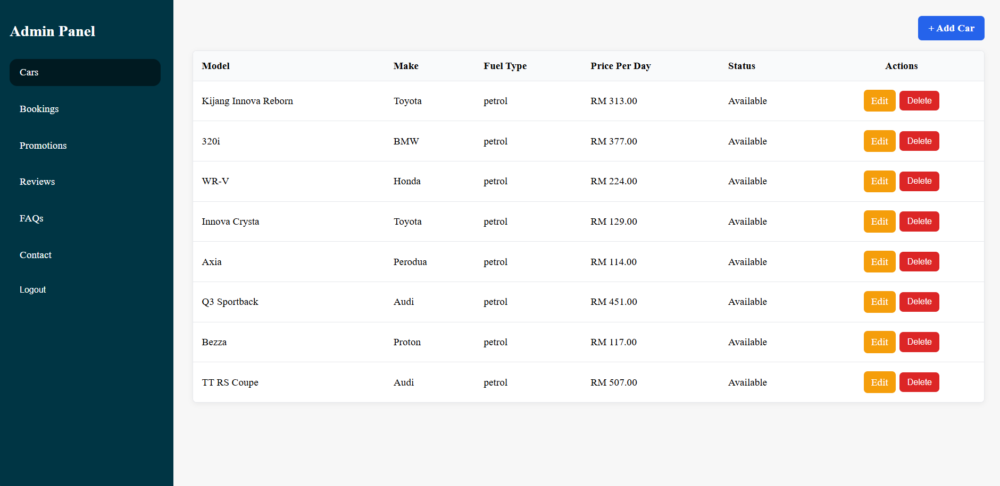
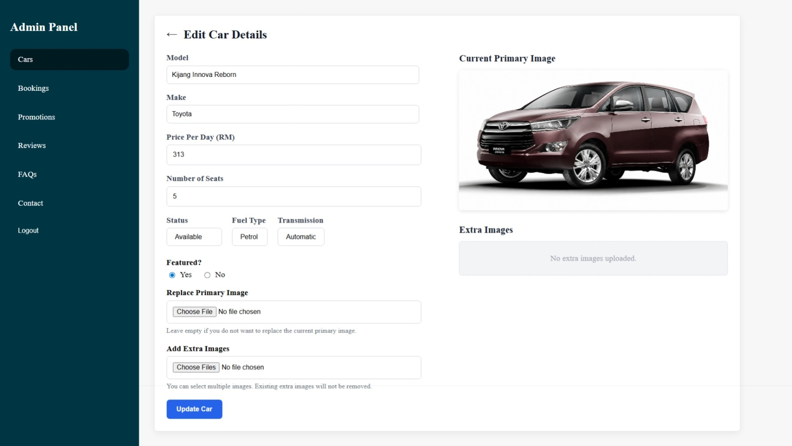

# Fleet Management & Booking System
This is a centralized system to manage availability of cars and bookings. Functionalities include:
- Client:
    - Login and signup
    - Browse & book a car
    - Browse bookings
    - Make payment
    - Submit a review
- Administrator:
    - Login as admin
    - Manage catalogs of cars
    - Manage status of bookings
    - Create, modify, & delete promotions
    - Create, modify, & delete reviews
    - Update content of Home page


## Prerequisite
1. PHP 
2. Composer
3. Laravel Breeze
4. Stripe

## How to Run the System
### Start a Laravel
```
php artisan serve
```
Note: Open the localhost URL shown in terminal

### Start a Breeze Breeze
```
npm run dev
```

## Stripe Webhook
```
stripe listen --forward-to localhost:8000/stripe/webhook
```

## User Interface



**Admin Dashboard**




## Attributions
1. The images of cars, with the exception of AI-generated Perodua and BMW, are retrieved from Kaggle: https://www.kaggle.com/datasets/fareselmenshawii/license-plate-dataset. 
2. The promotional image displayed on the right is sourced from [Unsplash](https://unsplash.com/@jessicamaephotographyga)

## License
The Laravel framework is open-sourced software licensed under the [MIT license](https://opensource.org/licenses/MIT).
