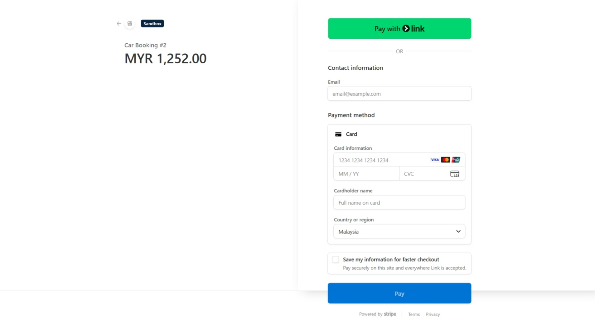

# Fleet Management & Booking System
This is a centralized system to manage availability of cars and bookings. Functionalities include:
- Client:
    - Login and signup
    - Browse & book a car
    - Browse bookings
    - Make payment
    - Submit a review
- Administrator:
    - Login as admin
    - Manage catalogs of cars
    - Manage status of bookings
    - Create, modify, & delete promotions
    - Create, modify, & delete reviews
    - Update content of Home page


## Prerequisite
1. PHP 
2. Composer
3. Laravel Breeze
4. Stripe

## Setup Instructions
1. **Clone a repository**
```
git clone https://github.com/jackleZac/fleet-management-booking-system.git
cd booking-system
```

2. **Install dependencies** (Make sure you have installed Composer)
```
compose install
```

3. **Start a Laravel**
```
php artisan serve
```
Note: Open the localhost URL shown in terminal

4. **Start a Laravel Breeze** (for authentication)
```
npm run dev
```

3. **Configure Stripe Webhook**
```
stripe listen --forward-to localhost:8000/stripe/webhook
```
### Run the project in Docker
1. Build and start a container
```
docker-compose up -d --build
```
**Note**: The website is accessible via http://localhost:8000/

2. Install dependencies
```
docker exec -it journeygo_app composer install
```

3. Create Laravel app encryption key
```
docker exec -it journeygo_app php artisan key:generate
```

4. Create MySQL tables
```
docker exec -it journeygo_app php artisan migrate
```

## User Interface




**Admin Dashboard**


## Attributions
1. The images of cars, with the exception of AI-generated Perodua and BMW, are retrieved from Kaggle: https://www.kaggle.com/datasets/fareselmenshawii/license-plate-dataset. 
2. The promotional image displayed on the right is sourced from [Unsplash](https://unsplash.com/@jessicamaephotographyga)


The following icons are downloaded from Flaticon:
- [Map marker icons](https://www.flaticon.com/free-icons/map-marker) created by **Elite Art** - Flaticon  
- [Restart icons](https://www.flaticon.com/free-icons/restart) created by **Freepik** - Flaticon  
- [Phone icons](https://www.flaticon.com/free-icons/phone) created by **Pixel perfect** - Flaticon  
- [Success icons](https://www.flaticon.com/free-icons/success) created by **hqrloveq** - Flaticon  
- [Search icons](https://www.flaticon.com/free-icons/search) created by **Pixel perfect** - Flaticon  
- [Right chevron icons](https://www.flaticon.com/free-icons/right-chevron) created by **th studio** - Flaticon  
- [Star icons](https://www.flaticon.com/free-icons/star) created by **Freepik** - Flaticon  
- [Transmission icons](https://www.flaticon.com/free-icons/transmission) created by **Tanah Basah** - Flaticon  
- [Seat icons](https://www.flaticon.com/free-icons/seat) created by **kawalanicon** - Flaticon  
- [Fuel icons](https://www.flaticon.com/free-icons/fuel) created by **Those Icons** - Flaticon  


## License
The Laravel framework is open-sourced software licensed under the [MIT license](https://opensource.org/licenses/MIT).
